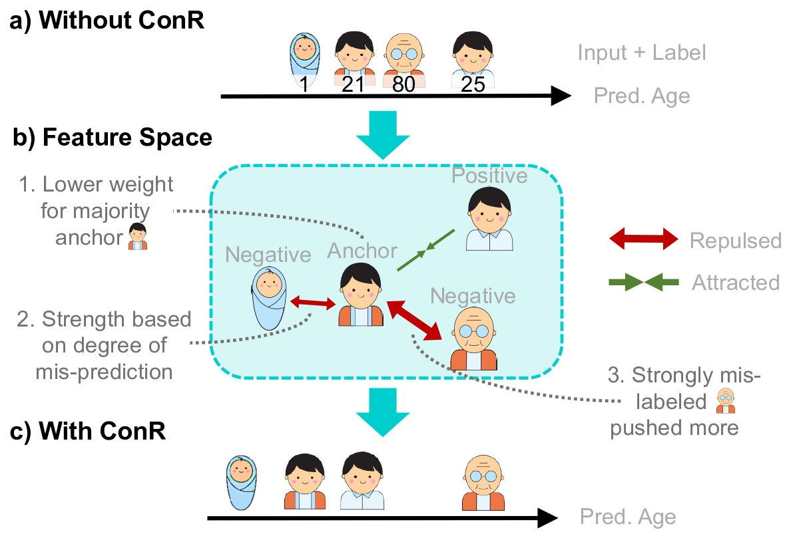

# ConR: Contrastive Regularizer for Deep Imbalanced Regression

This repository contains the code for the ICLR 2024 paper: <be>
[__ConR: Contrastive Regularizer for Deep Imbalanced Regression__]([http://arxiv.org/abs/2309.06651](https://openreview.net/forum?id=RIuevDSK5V))<br> 
Mahsa Keramati, Lili Meng, R David Evans <br>

<p align="center">
     <br>
<b>ConR </b> key insights. a) Without ConR, it
is common to have minority examples mixed with
majority examples. b) ConR adds additional loss
weight for minority, and mis-labelled examples,
resulting in better feature representations and c)
better prediction error.
</p>

## Quick Preview
<b>ConR </b> is complementary to conventional imbalanced learning techniques. The following code snippent shows the implementation of ConR for the task of Age estimation

```python
def ConR(features, targets, preds, w=1, weights=1, t=0.07, e=0.01):
    q = torch.nn.functional.normalize(features, dim=1)
    k = torch.nn.functional.normalize(features, dim=1)

    l_k = targets.flatten()[None, :]
    l_q = targets

    p_k = preds.flatten()[None, :]
    p_q = preds

    l_dist = torch.abs(l_q - l_k)
    p_dist = torch.abs(p_q - p_k)

    pos_i = l_dist.le(w)
    neg_i = ((~ (l_dist.le(w))) * (p_dist.le(w)))

    for i in range(pos_i.shape[0]):
        pos_i[i][i] = 0

    prod = torch.einsum("nc,kc->nk", [q, k]) / t
    pos = prod * pos_i
    neg = prod * neg_i

    pushing_w = weights * torch.exp(l_dist * e)
    neg_exp_dot = (pushing_w * (torch.exp(neg)) * neg_i).sum(1)

    # For each query sample, if there is no negative pair, zero-out the loss.
    no_neg_flag = (neg_i).sum(1).bool()

    # Loss = sum over all samples in the batch (sum over (positive dot product/(negative dot product+positive dot product)))
    denom = pos_i.sum(1)

    loss = ((-torch.log(
        torch.div(torch.exp(pos), (torch.exp(pos).sum(1) + neg_exp_dot).unsqueeze(-1))) * (
                 pos_i)).sum(1) / denom)

    loss = (weights * (loss * no_neg_flag).unsqueeze(-1)).mean()

    return loss
```

## Usage

Please go into the sub-folder to run experiments for different datasets. 

- [IMDB-WIKI-DIR](./imdb-wiki-dir)
- [AgeDB-DIR](./agedb-dir)
- [NYUD2-DIR](./nyud2-dir)


## Acknowledgment

The code is based on [Yang et al., Delving into Deep Imbalanced Regression, ICML 2021](https://github.com/YyzHarry/imbalanced-regression/tree/main/imdb-wiki-dir) and [Ren et al.,Balanced MSE for Imbalanced Visual Regression, CVPR 2022](https://github.com/jiawei-ren/BalancedMSE). 
